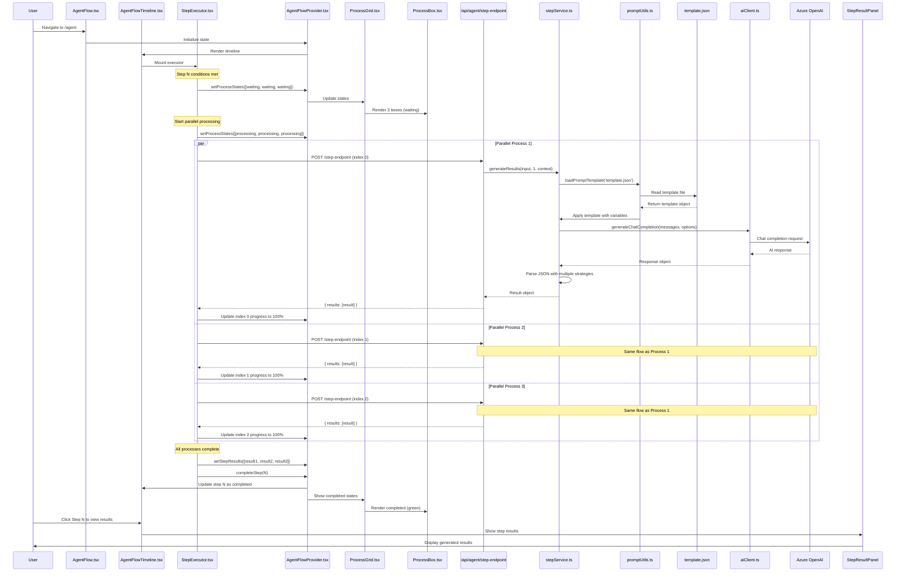
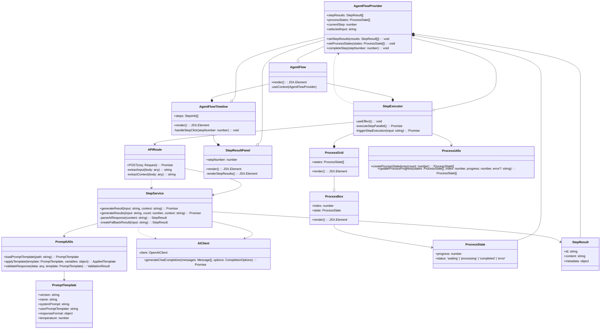
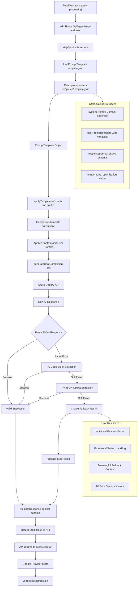

# AI UI Agent Core Capabilities Blueprint

**Last Updated:** June 16, 2025

This blueprint summarizes the key technical decisions and patterns implemented in the TSLA AI UI Agent project. It serves as a high-level reference for new contributors and a record of why certain approaches were chosen.

## 1. Next.js 15 App Router Architecture

- **Server Components** handle data fetching, Azure SDK calls, and heavy logic.
- **Client Components** manage interactive UI pieces and state-driven flows.
- **Hybrid Rendering** mixes SSR for first‑load performance with CSR for dynamic user interactions.
- **Feature Folders** under `features/` keep related UI, API routes and helpers together.

The entry points under `app/` expose pages for the agent (`/agent`), a basic
dashboard (`/dashboard`) and simple testing routes. API endpoints live under
`app/api/agent/*` and call service functions from the `lib` folder. This keeps
server logic inside the App Router where it is executed on the server.

## 2. Step‑Based Agent Workflow

- The agent progresses through defined steps (design concept, evaluation, figma specs, code generation, etc.).
- Context providers (`AgentFlowProvider`) manage global state and expose helper actions.
- A direct API triggering pattern ensures sequential calls fire reliably without waiting for React state batching.
- Step execution is orchestrated in `StepExecutor.tsx`. It calls the API routes
  in order and updates the provider state when each request succeeds.
- `AgentFlowTimeline.tsx` renders progress indicators and allows step detail
  toggling via utilities from `lib/utils/stepResults.ts`.

### Complex Step Implementation Patterns

For sophisticated steps requiring parallel processing (like Step 3.5 Figma Spec Generation):

- **Real Parallel Processing**: Use `Promise.all()` and `Promise.allSettled()` for true parallelization
- **Staggered Progress Updates**: Implement different intervals (200ms + index * 100ms) to prevent UI conflicts
- **Multi-Level State Management**: Provider-level global state + component-level progress tracking
- **Comprehensive Error Handling**: Individual process errors, partial failure handling, and meaningful fallbacks
- **Real-Time Progress Visualization**: Visual feedback with color-coded states and progress bars

## 3. Azure Integration via DefaultAzureCredential

- All Azure services (Blob Storage, AI Foundry) authenticate using `DefaultAzureCredential`.
- Credentials are supplied through environment variables or Managed Identity in production.
- Service clients are encapsulated in `lib/daos/` for reuse across the app.
- `storageClient.ts` manages the executions container and blob uploads.
- `aiClient.ts` wraps the Azure OpenAI SDK with helper functions such as
  `generateChatCompletion`.

## 4. Service and DAO Layering

- **DAO Layer**: Wraps direct service calls (e.g., `aiClient.ts`, `storageClient.ts`).
- **Service Layer**: Contains business logic like design evaluation, scoring, and execution tracing.
- This separation keeps components thin and simplifies unit testing.
- `designConcept.ts` and `designEvaluation.ts` implement the core agent logic of
  generating multiple concepts and ranking them.
- `figmaSpec.ts` demonstrates complex service implementation with AI integration,
  multiple JSON extraction strategies, and comprehensive error handling.
- `specSelection.ts` provides simple helpers for picking the best option.

### Service Implementation Best Practices

From Step 3.5 implementation learnings:

- **Comprehensive Logging**: Detailed console logging for debugging complex AI interactions
- **Multiple Parsing Strategies**: Handle various AI response formats with fallback mechanisms
- **Graceful Error Handling**: Always provide meaningful fallback content when AI calls fail
- **Template Integration**: Use prompt templates from `prompts/` for consistent AI interactions
- **Type Safety**: Strong TypeScript typing throughout service layer

## 5. Testing & Quality Assurance

- Baseline authentication tests verify Azure connectivity in all environments.
- Linting (`npm run lint`) and build checks (`npm run build`) are required before commits.
- Key issues and resolutions are documented in [Key Issue Resolution](../key-issue-resolution/).
- A comprehensive test suite under `tests/` exercises multiple layers:
  - **DAO Layer**: `tests/dao/ai-connection.test.js` for Azure connectivity
  - **Endpoints**: `tests/endpoints/` for API route testing
  - **Services**: `tests/services/` for business logic validation
  - **UI**: `tests/ui/` for component and integration testing
- Run all tests with `npm run test:all` or specific categories with dedicated runners.

### Testing Strategy for Complex Features

Lessons from Step 3.5 comprehensive testing:

- **Multi-Layer Testing**: Cover API endpoints, service logic, state management, and UI components
- **Error Scenario Coverage**: Test partial failures, network errors, and AI response parsing failures
- **State Management Validation**: Verify provider state updates and component synchronization
- **Performance Testing**: Validate parallel processing performance vs. sequential alternatives
- **Quality Validation**: Test output quality and structure, not just functionality

## 6. Prompt Template System

- Prompt templates stored in `prompts/` are loaded via
  `lib/utils/promptUtils.ts`.
- Templates define a system prompt, a user prompt template and expected response
  shape which is validated after calling the LLM.
- This ensures repeatable AI requests and easier debugging of parsing failures.

### Advanced Prompt Engineering Patterns

Enhanced patterns from Step 3.5 implementation:

- **Professional Domain Expertise**: Templates incorporate specific domain knowledge (UX/UI design principles)
- **Modern Standards Integration**: Include accessibility, responsive design, and current best practices
- **Structured Response Formats**: Use JSON schemas to enforce consistent AI output structure
- **Temperature Optimization**: Fine-tune creativity vs. consistency for different use cases
- **Multi-Strategy Parsing**: Handle various AI response formats with extraction fallbacks

## 7. State Management Architecture

Advanced state management patterns for complex features:

### Provider Pattern Implementation
- **Global State**: Use React Context providers for cross-component state sharing
- **Type Safety**: Strong TypeScript interfaces for all state objects
- **State Isolation**: Separate concerns (e.g., `figmaSpecs` vs `figmaSpecStates`)
- **Update Patterns**: Immutable state updates with proper React patterns

### Component State Coordination
- **Multi-Level State**: Provider (global) + Component (local) + Process (individual) levels
- **State Synchronization**: useEffect hooks for coordinating between async processes
- **Progress Tracking**: Real-time state updates during long-running operations
- **Error State Management**: Comprehensive error state handling across all levels

## 8. Performance & User Experience Patterns

### Real-Time Feedback Systems
- **Progress Visualization**: Real-time progress bars with meaningful status updates
- **Staggered Updates**: Prevent UI conflicts with offset timing (200ms + index * 100ms)
- **Visual State Indicators**: Color-coded status (waiting, processing, completed, error)
- **Responsive Design**: Grid layouts that work across device sizes

### Error Resilience Patterns
- **Partial Failure Handling**: Use `Promise.allSettled()` for graceful degradation
- **Meaningful Fallbacks**: Provide useful content even when processes fail
- **Error Recovery**: Clear error messaging with actionable information
- **Progressive Enhancement**: Features work with reduced functionality during failures

## 9. Agent Step Timeline Architecture

Visual representation of how complex agent steps are implemented in the timeline workflow.

### Architecture Diagrams

#### Sequence Diagram: Complex Agent Step Execution Flow

#### Class Diagram: Agent Step Component Architecture

#### Data Flow Diagram: Template to AI Response Processing

---

## Development Guidelines

### Building Complex Pipeline Steps

Based on Step 3.5 implementation analysis, follow these patterns for sophisticated features:

1. **Real Functionality First**: Never implement simulation - build actual functionality from the start
2. **Error-First Design**: Plan comprehensive error handling before implementing happy path
3. **State Management Strategy**: Use provider pattern for complex multi-component state
4. **Progress Feedback**: Implement real-time user feedback for long-running operations
5. **Comprehensive Testing**: Cover all scenarios including edge cases and partial failures
6. **Performance Optimization**: Consider parallel processing and user experience impacts

### Code Quality Standards

- **TypeScript Compliance**: Strong typing throughout all layers
- **Error Boundaries**: Graceful error handling with meaningful user feedback
- **Performance Awareness**: Optimize for user experience and perceived performance
- **Test Coverage**: High coverage with realistic scenarios, not just unit tests
- **Documentation**: Clear technical documentation for complex architectural decisions

For detailed implementation examples, see:
- [Step 3.5 Implementation Analysis](./step-3.5-implementation-analysis.md) for complex parallel processing patterns
- Individual documents in this `blueprint` directory for specific architectural decisions
- The PRD for feature specifications and requirements
