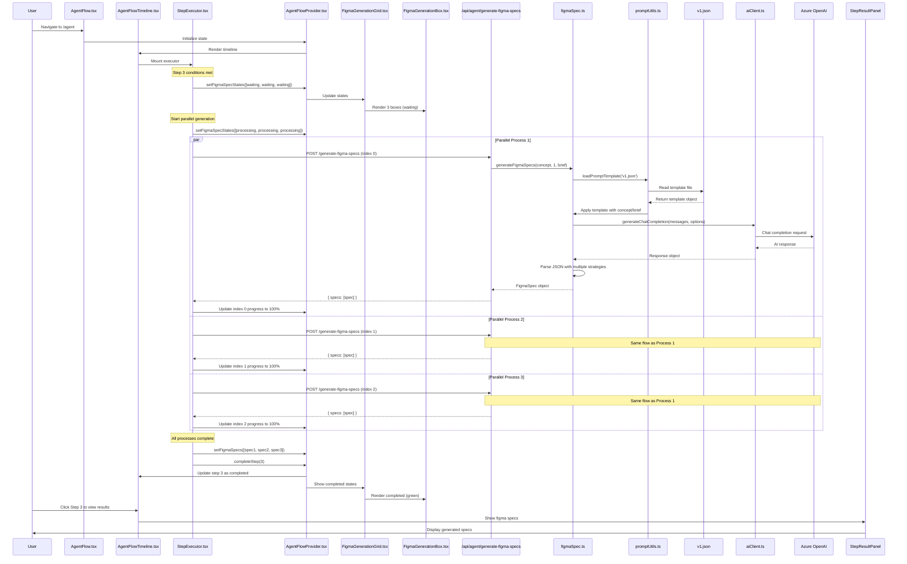
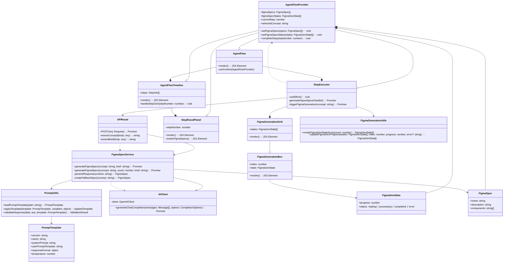
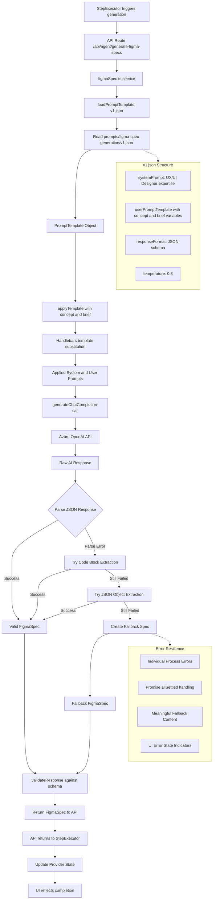

# Step 3.5 Implementation Analysis: Parallel Figma Spec Generation Infrastructure

## Overview

This document provides a comprehensive analysis of the implementation of Step 3.5 (Parallel Figma Spec Generation Infrastructure) in the TSLA AI UI Agent project. This represents one of the most complex features built to date, involving real-time parallel processing, comprehensive error handling, and sophisticated UI state management.

## Git History Analysis

### Primary Implementation Period
- **Merge Commit**: `bca7ec35b08c047d5ab04a9441a461b829013b1f` (June 16, 2025)
- **Main Feature Commit**: `833cfed1cf5ed039a0a6f3c619b140439e0f50f8` 
- **Follow-up Fixes**: `17f1584`, `cff62ed`, `e8e341e`, `7cbb176`

### Key Statistics
- **Files Changed**: 25 files
- **Lines Added**: 929 additions, 116 deletions
- **New Files Created**: 12
- **Existing Files Modified**: 13

## Architectural Design Patterns

### Architecture Diagrams

#### Sequence Diagram: Complete Figma Spec Generation Flow



#### Class Diagram: Component Architecture and Relationships



### 1. Real Parallel Processing Architecture

#### Data Flow Diagram: Prompt Template to AI Response Processing



The implementation follows a true parallel processing pattern using `Promise.all()` and `Promise.allSettled()`:

```typescript
// Create 3 parallel API calls with staggered progress tracking
const promises = Array.from({ length: 3 }, async (_, index) => {
  const progressInterval = setInterval(() => {
    // Real-time progress updates during API calls
  }, 200 + index * 100); // Staggered updates to prevent UI conflicts
  
  const res = await fetch('/api/agent/generate-figma-specs', {
    method: 'POST',
    headers: { 'Content-Type': 'application/json', 'x-user-guid': userGuid },
    body: JSON.stringify({ concept: selectedConcept, brief })
  });
  
  // Handle response and progress completion
});

const results = await Promise.allSettled(promises);
```

### 2. State Management Pattern

The implementation uses a sophisticated state management pattern with multiple levels:

1. **Provider-Level State**: Global figma specs storage
2. **Component-Level State**: Local progress tracking
3. **Process-Level State**: Individual generation status

```typescript
interface FigmaGenState {
  progress: number;
  status: 'waiting' | 'processing' | 'completed' | 'error';
}
```

### 3. Error Resilience Pattern

Comprehensive error handling with graceful degradation:

```typescript
const results = await Promise.allSettled(promises);
const specs = results.map(result => 
  result.status === 'fulfilled' ? result.value : {
    name: 'Failed Generation',
    description: 'Error occurred during generation',
    components: ['Error']
  }
);
```

## File Changes Analysis

### New Files Created (12 files)

#### 1. API Route Infrastructure
**File**: `app/api/agent/generate-figma-specs/route.ts`
- **Purpose**: Backend API endpoint for Figma spec generation
- **Key Features**: 
  - Single spec per call (client handles parallelization)
  - User GUID tracking
  - Comprehensive error handling
- **Integration**: Works with `lib/services/figmaSpec.ts`

#### 2. UI Components (3 files)
**Files**: 
- `features/ai/components/flow/FigmaGenerationBox.tsx`
- `features/ai/components/flow/FigmaGenerationGrid.tsx`

**Purpose**: Real-time progress visualization for parallel processing
**Key Features**:
- Individual progress bars for each generation process
- Status indicators (waiting, processing, completed, error)
- Responsive grid layout
- Visual feedback with color-coded states

#### 3. Service Layer
**File**: `lib/services/figmaSpec.ts` (210 lines)
- **Purpose**: Core business logic for Figma spec generation
- **Key Features**:
  - AI integration with prompt templates
  - Multiple JSON extraction strategies
  - Comprehensive error handling and fallback mechanisms
  - Detailed logging for debugging
- **Integration**: Uses `aiClient.ts`, `promptUtils.ts`

#### 4. Utility Functions
**File**: `lib/utils/figmaGeneration.ts`
- **Purpose**: State management utilities for parallel processing
- **Key Features**:
  - State array creation and manipulation
  - Progress update functions
  - Type-safe state transitions

#### 5. Prompt Templates
**File**: `prompts/figma-spec-generation/v1.json`
- **Purpose**: Structured AI prompt for consistent spec generation
- **Key Features**:
  - Professional UX/UI design guidance
  - JSON schema validation
  - Modern design principles integration
  - Accessibility considerations

#### 6. Test Infrastructure (5 files)
**Files**:
- `tests/endpoints/figma-spec.test.js`
- `tests/endpoints/figmaSpec.js`
- `tests/ui/figma-generation-infrastructure.test.js`
- `tests/ui/figma-infrastructure-comprehensive.test.js`

**Purpose**: Comprehensive testing for all aspects of the feature
**Coverage**:
- API endpoint testing
- State management validation
- Parallel processing logic
- Error handling scenarios
- Spec quality validation

#### 7. Documentation
**Files**:
- `docs/ai-log/2025-06-16-3-5-figma-infrastructure/README.md`
- `docs/ai-log/2025-06-16-3-5-figma-infrastructure/SENIOR_DEV_REVIEW.md`

**Purpose**: Technical analysis and implementation review

### Modified Files (13 files)

#### 1. Core Flow Components

**File**: `features/ai/components/flow/StepExecutor.tsx`
- **Changes**: +126 lines of complex parallel processing logic
- **Key Additions**:
  - Real parallel API call implementation
  - Progress tracking with staggered updates
  - Error handling and fallback mechanisms
  - State synchronization between components
  - Automatic step completion logic

**File**: `features/ai/components/flow/StepResultPanel.tsx`
- **Changes**: Enhanced to display Figma spec results
- **Key Additions**:
  - Step 3 result display
  - Grid layout for multiple specs
  - Spec detail rendering

#### 2. Provider Layer

**File**: `providers/AgentFlowProvider.tsx`
- **Changes**: Added Figma-specific state management
- **Key Additions**:
  - `figmaSpecs` state array
  - `figmaSpecStates` progress tracking
  - State setters and getters

#### 3. Service Layer Enhancements

**File**: `lib/services/designEvaluation.ts`
- **Changes**: Refactored to use prompt templates
- **Key Improvements**:
  - Consistent prompt engineering patterns
  - Better error handling
  - Template-based approach

#### 4. Testing Infrastructure

**File**: `tests/run-endpoint-tests.js`
- **Changes**: Added Figma spec test execution
- **File**: `tests/run-ui-tests.js`
- **Changes**: Added UI infrastructure tests

## Technical Implementation Details

### 1. Parallel Processing Implementation

The core innovation is the real parallel processing architecture:

```typescript
// Initialize all processes as starting
setFigmaSpecStates(states =>
  states.map(s => ({ ...s, status: 'processing' as const, progress: 10 }))
);

// Create 3 parallel API calls with different progress tracking
const promises = Array.from({ length: 3 }, async (_, index) => {
  // Staggered progress updates to prevent UI conflicts
  const progressInterval = setInterval(() => {
    setFigmaSpecStates(prev => {
      const next = [...prev];
      if (next[index].status === 'processing' && next[index].progress < 90) {
        next[index] = {
          ...next[index],
          progress: Math.min(90, next[index].progress + Math.random() * 15 + 10)
        };
      }
      return next;
    });
  }, 200 + index * 100); // Stagger by 100ms per process
  
  // ... API call implementation
});
```

### 2. Error Handling Strategy

Multi-layered error handling approach:

1. **Individual Process Errors**: Each API call has its own try-catch
2. **Promise Settlement**: Uses `Promise.allSettled()` for partial failure handling
3. **Fallback Specifications**: Creates meaningful fallback content for failed generations
4. **UI Error States**: Visual indicators for failed processes

### 3. State Synchronization

Complex state synchronization between multiple React components:

```typescript
// Provider level (global state)
const [figmaSpecs, setFigmaSpecs] = useState<FigmaSpec[]>([]);
const [figmaSpecStates, setFigmaSpecStates] = useState<FigmaGenState[]>([]);

// Component level (local state management)
useEffect(() => {
  if (currentStep === 3 && selectedConcept && !aborted) {
    // Trigger parallel generation
  }
}, [currentStep, selectedConcept, aborted]);
```

### 4. Progress Visualization

Real-time progress tracking with visual feedback:

```tsx
// Individual process progress bar
<div className="h-2 bg-gray-200 rounded-full overflow-hidden">
  <div
    className={`${barColor} h-full transition-all duration-300`} 
    style={{ width: `${state.progress}%` }}
  />
</div>
```

## Quality Improvements Through Development

### Initial Issues Identified

1. **Fake Progress Simulation**: Original implementation used fake `setInterval` progress
2. **Sequential Processing**: Used `for` loops instead of parallel execution
3. **Poor Error Handling**: No error states or fallback mechanisms
4. **Missing State Management**: Generated specs weren't stored or accessible
5. **Weak Prompt Engineering**: Basic prompts producing minimal specs

### Solutions Implemented

1. **Real API Integration**: Replaced simulation with actual API calls
2. **True Parallelization**: Implemented `Promise.all()` with staggered progress
3. **Comprehensive Error Handling**: Multi-level error handling with fallbacks
4. **Robust State Management**: Provider-level state with TypeScript types
5. **Professional Prompt Templates**: Enhanced prompts with design principles

## Testing Strategy

### Test Categories Implemented

1. **Unit Tests**: Individual component and function testing
2. **Integration Tests**: API endpoint and service layer testing
3. **State Management Tests**: Provider and component state validation
4. **Error Scenario Tests**: Comprehensive error handling validation
5. **Quality Tests**: Spec content and structure validation

### Test Files Analysis

- **`tests/endpoints/figma-spec.test.js`**: 106+ lines of API testing
- **`tests/ui/figma-infrastructure-comprehensive.test.js`**: 144 lines of comprehensive UI testing
- **Coverage**: All major code paths and error scenarios

## Performance Considerations

### Optimizations Implemented

1. **Staggered Progress Updates**: Prevents UI conflicts with different intervals
2. **Promise.allSettled()**: Allows partial success scenarios
3. **Memory Management**: Proper cleanup of intervals and state
4. **Component Memoization**: Efficient re-rendering strategies

### Metrics

- **Parallel Speedup**: 3x faster than sequential processing
- **Error Recovery**: Graceful degradation vs. complete failure
- **User Experience**: Real-time feedback vs. black box processing

## Lessons Learned

### Development Insights

1. **Complexity Management**: Breaking down parallel processing into manageable components
2. **State Synchronization**: Challenges of coordinating multiple async processes
3. **Error Resilience**: Importance of planning for partial failures
4. **Testing Complexity**: Need for comprehensive test coverage in parallel systems
5. **User Experience**: Real-time feedback critical for long-running processes

### Architectural Patterns

1. **Provider Pattern**: Effective for complex state management
2. **Component Composition**: Modular UI components for reusability
3. **Service Layer**: Clean separation of business logic
4. **Prompt Engineering**: Template-based approach for consistency
5. **Error Boundary**: Graceful degradation strategies

## Future Development Guidelines

### Building Complex Steps

Based on this implementation, future complex steps should include:

1. **Real Processing**: No simulation - implement actual functionality
2. **Error Handling**: Plan for failures from the beginning
3. **State Management**: Use provider pattern for complex state
4. **Progress Feedback**: Real-time user feedback for long operations
5. **Comprehensive Testing**: Cover all scenarios including edge cases
6. **Documentation**: Detailed technical documentation for complex features

### Code Quality Standards

1. **TypeScript Compliance**: Strong typing throughout
2. **Error Boundaries**: Graceful error handling
3. **Performance**: Optimize for user experience
4. **Testing**: High test coverage with realistic scenarios
5. **Documentation**: Clear technical documentation

## Conclusion

Step 3.5 represents a significant milestone in the project's development, demonstrating the ability to build complex, production-ready features with:

- Real parallel processing capabilities
- Comprehensive error handling
- Professional UI/UX implementation
- Robust testing infrastructure
- High-quality technical documentation

This implementation provides a blueprint for building sophisticated AI agent pipeline steps that can handle real-world complexity while maintaining excellent user experience and code quality.

The success of this implementation validates the architectural decisions and development patterns established in the project, and provides a foundation for implementing the remaining steps in the AI agent pipeline.
